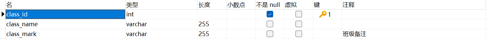

 <h1 class="curproject-name"> 寄汤 </h1>

## 计算机1901 沈熙晨 31901026
## 计算机1901 沈正阳 31901027
## 本小组仅有两人

# 需求分析
### 1.实现基本数据的增删改查以及维护
### 2.在非法输入时能够识别并拒绝服务
### 3.实现用户请求接口时的权限判断服务

#功能设计

       

#ER图

##用户类型

##班级类型：考虑到这本质是一种考试系统，于是对班级这一概念做简化处理，班级仅仅是记录学生列表的媒介

##班级名单

##选项（仅选择题有选项）

##选项表

##题目：题目应当有问题内容，问题类型以及参考答案

##题目列表：用来记录题目和选项的链接

##考试：考试有创建时间，开始时间和结束时间，以及考试状态创建者id和考试说明

##答卷表：答卷表应当要记录考试信息，学生id以及上传时间，还会记录得分（未打分时默认为-1以示未经批改）

##答卷详细表：要记录是哪个答卷的哪道题

#难点重点
### 1.实现通过JWT的权限认证系统
### 2.实现自动批卷（仅客观题）功能
### 3.swagger和yapi自动化管理api
### 4.实现统一的返回数据格式（即不论如何都有统一格式的数据返回）

#接口设计
     
# 班级管理

## 修改班级信息

### 基本信息

**Path：** /class/modify

**Method：** GET

**接口描述：**

### 请求参数
**Headers**

| 参数名称  | 参数值  |  是否必须 | 示例  | 备注  |
| ------------ | ------------ | ------------ | ------------ | ------------ |
| Content-Type  |  application/json | 是  |   |   |
**Body**

<table>
  <thead class="ant-table-thead">
    <tr>
      <th key=name>名称</th><th key=type>类型</th><th key=required>是否必须</th><th key=default>默认值</th><th key=desc>备注</th><th key=sub>其他信息</th>
    </tr>
  </thead><tbody className="ant-table-tbody"><tr key=0-0><td key=0> classMark</td><td key=1>string</td><td key=2>非必须</td><td key=3></td><td key=4></td><td key=5></td></tr><tr key=0-1><td key=0> className</td><td key=1>string</td><td key=2>非必须</td><td key=3></td><td key=4></td><td key=5></td></tr><tr key=0-2><td key=0> classUserLinks</td><td key=1>object []</td><td key=2>非必须</td><td key=3></td><td key=4></td><td key=5>
item 类型: object
</td></tr><tr key=0-2-0><td key=0>├─ department</td><td key=1>string</td><td key=2>非必须</td><td key=3></td><td key=4></td><td key=5></td></tr><tr key=0-2-1><td key=0>├─ id</td><td key=1>integer</td><td key=2>非必须</td><td key=3></td><td key=4></td><td key=5>
format: int32
</td></tr><tr key=0-2-2><td key=0>├─ userName</td><td key=1>string</td><td key=2>非必须</td><td key=3></td><td key=4></td><td key=5></td></tr><tr key=0-2-3><td key=0>├─ userPassword</td><td key=1>string</td><td key=2>非必须</td><td key=3></td><td key=4></td><td key=5></td></tr><tr key=0-2-4><td key=0>├─ userType</td><td key=1>string</td><td key=2>非必须</td><td key=3></td><td key=4></td><td key=5></td></tr><tr key=0-3><td key=0> id</td><td key=1>integer</td><td key=2>非必须</td><td key=3></td><td key=4></td><td key=5>
format: int32
</td></tr>
               </tbody>
              </table>
            
### 返回数据

<table>
  <thead class="ant-table-thead">
    <tr>
      <th key=name>名称</th><th key=type>类型</th><th key=required>是否必须</th><th key=default>默认值</th><th key=desc>备注</th><th key=sub>其他信息</th>
    </tr>
  </thead><tbody className="ant-table-tbody">
               </tbody>
              </table>
            
## 列出所有班级

### 基本信息

**Path：** /class/list

**Method：** GET

**接口描述：**

### 请求参数

### 返回数据

<table>
  <thead class="ant-table-thead">
    <tr>
      <th key=name>名称</th><th key=type>类型</th><th key=required>是否必须</th><th key=default>默认值</th><th key=desc>备注</th><th key=sub>其他信息</th>
    </tr>
  </thead><tbody className="ant-table-tbody">
               </tbody>
              </table>
            
## 往班级里加一个人

### 基本信息

**Path：** /class/add-one

**Method：** GET

**接口描述：**

### 请求参数
**Headers**

| 参数名称  | 参数值  |  是否必须 | 示例  | 备注  |
| ------------ | ------------ | ------------ | ------------ | ------------ |
| Content-Type  |  application/json | 是  |   |   |
**Query**

| 参数名称  |  是否必须 | 示例  | 备注  |
| ------------ | ------------ | ------------ | ------------ |
| classId | 否  |   |  classId |
**Body**

<table>
  <thead class="ant-table-thead">
    <tr>
      <th key=name>名称</th><th key=type>类型</th><th key=required>是否必须</th><th key=default>默认值</th><th key=desc>备注</th><th key=sub>其他信息</th>
    </tr>
  </thead><tbody className="ant-table-tbody"><tr key=0-0><td key=0> department</td><td key=1>string</td><td key=2>非必须</td><td key=3></td><td key=4></td><td key=5></td></tr><tr key=0-1><td key=0> id</td><td key=1>integer</td><td key=2>非必须</td><td key=3></td><td key=4></td><td key=5>
format: int32
</td></tr><tr key=0-2><td key=0> userName</td><td key=1>string</td><td key=2>非必须</td><td key=3></td><td key=4></td><td key=5></td></tr><tr key=0-3><td key=0> userPassword</td><td key=1>string</td><td key=2>非必须</td><td key=3></td><td key=4></td><td key=5></td></tr><tr key=0-4><td key=0> userType</td><td key=1>string</td><td key=2>非必须</td><td key=3></td><td key=4></td><td key=5></td></tr>
               </tbody>
              </table>
            
### 返回数据

<table>
  <thead class="ant-table-thead">
    <tr>
      <th key=name>名称</th><th key=type>类型</th><th key=required>是否必须</th><th key=default>默认值</th><th key=desc>备注</th><th key=sub>其他信息</th>
    </tr>
  </thead><tbody className="ant-table-tbody">
               </tbody>
              </table>
            
## 往班级里加一群人

### 基本信息

**Path：** /class/add-many

**Method：** GET

**接口描述：**

### 请求参数
**Headers**

| 参数名称  | 参数值  |  是否必须 | 示例  | 备注  |
| ------------ | ------------ | ------------ | ------------ | ------------ |
| Content-Type  |  application/json | 是  |   |   |
**Query**

| 参数名称  |  是否必须 | 示例  | 备注  |
| ------------ | ------------ | ------------ | ------------ |
| classId | 否  |   |  classId |
**Body**

<table>
  <thead class="ant-table-thead">
    <tr>
      <th key=name>名称</th><th key=type>类型</th><th key=required>是否必须</th><th key=default>默认值</th><th key=desc>备注</th><th key=sub>其他信息</th>
    </tr>
  </thead><tbody className="ant-table-tbody"><tr key=0><td key=0> </td><td key=1>object []</td><td key=2>非必须</td><td key=3></td><td key=4></td><td key=5>
item 类型: object
</td></tr><tr key=0-0><td key=0>├─ department</td><td key=1>string</td><td key=2>非必须</td><td key=3></td><td key=4></td><td key=5></td></tr><tr key=0-1><td key=0>├─ id</td><td key=1>integer</td><td key=2>非必须</td><td key=3></td><td key=4></td><td key=5>
format: int32
</td></tr><tr key=0-2><td key=0>├─ userName</td><td key=1>string</td><td key=2>非必须</td><td key=3></td><td key=4></td><td key=5></td></tr><tr key=0-3><td key=0>├─ userPassword</td><td key=1>string</td><td key=2>非必须</td><td key=3></td><td key=4></td><td key=5></td></tr><tr key=0-4><td key=0>├─ userType</td><td key=1>string</td><td key=2>非必须</td><td key=3></td><td key=4></td><td key=5></td></tr>
               </tbody>
              </table>
            
### 返回数据

<table>
  <thead class="ant-table-thead">
    <tr>
      <th key=name>名称</th><th key=type>类型</th><th key=required>是否必须</th><th key=default>默认值</th><th key=desc>备注</th><th key=sub>其他信息</th>
    </tr>
  </thead><tbody className="ant-table-tbody">
               </tbody>
              </table>
            
## 成立有人的班级

### 基本信息

**Path：** /class/create

**Method：** GET

**接口描述：**

### 请求参数
**Headers**

| 参数名称  | 参数值  |  是否必须 | 示例  | 备注  |
| ------------ | ------------ | ------------ | ------------ | ------------ |
| Content-Type  |  application/json | 是  |   |   |
**Body**

<table>
  <thead class="ant-table-thead">
    <tr>
      <th key=name>名称</th><th key=type>类型</th><th key=required>是否必须</th><th key=default>默认值</th><th key=desc>备注</th><th key=sub>其他信息</th>
    </tr>
  </thead><tbody className="ant-table-tbody"><tr key=0-0><td key=0> classMark</td><td key=1>string</td><td key=2>非必须</td><td key=3></td><td key=4></td><td key=5></td></tr><tr key=0-1><td key=0> className</td><td key=1>string</td><td key=2>非必须</td><td key=3></td><td key=4></td><td key=5></td></tr><tr key=0-2><td key=0> classUserLinks</td><td key=1>object []</td><td key=2>非必须</td><td key=3></td><td key=4></td><td key=5>
item 类型: object
</td></tr><tr key=0-2-0><td key=0>├─ department</td><td key=1>string</td><td key=2>非必须</td><td key=3></td><td key=4></td><td key=5></td></tr><tr key=0-2-1><td key=0>├─ id</td><td key=1>integer</td><td key=2>非必须</td><td key=3></td><td key=4></td><td key=5>
format: int32
</td></tr><tr key=0-2-2><td key=0>├─ userName</td><td key=1>string</td><td key=2>非必须</td><td key=3></td><td key=4></td><td key=5></td></tr><tr key=0-2-3><td key=0>├─ userPassword</td><td key=1>string</td><td key=2>非必须</td><td key=3></td><td key=4></td><td key=5></td></tr><tr key=0-2-4><td key=0>├─ userType</td><td key=1>string</td><td key=2>非必须</td><td key=3></td><td key=4></td><td key=5></td></tr><tr key=0-3><td key=0> id</td><td key=1>integer</td><td key=2>非必须</td><td key=3></td><td key=4></td><td key=5>
format: int32
</td></tr>
               </tbody>
              </table>
            
### 返回数据

<table>
  <thead class="ant-table-thead">
    <tr>
      <th key=name>名称</th><th key=type>类型</th><th key=required>是否必须</th><th key=default>默认值</th><th key=desc>备注</th><th key=sub>其他信息</th>
    </tr>
  </thead><tbody className="ant-table-tbody">
               </tbody>
              </table>
            
## 成立空班级

### 基本信息

**Path：** /class/create-empty

**Method：** GET

**接口描述：**

### 请求参数
**Headers**

| 参数名称  | 参数值  |  是否必须 | 示例  | 备注  |
| ------------ | ------------ | ------------ | ------------ | ------------ |
| Content-Type  |  application/json | 是  |   |   |
**Body**

<table>
  <thead class="ant-table-thead">
    <tr>
      <th key=name>名称</th><th key=type>类型</th><th key=required>是否必须</th><th key=default>默认值</th><th key=desc>备注</th><th key=sub>其他信息</th>
    </tr>
  </thead><tbody className="ant-table-tbody"><tr key=0-0><td key=0> classMark</td><td key=1>string</td><td key=2>非必须</td><td key=3></td><td key=4></td><td key=5></td></tr><tr key=0-1><td key=0> className</td><td key=1>string</td><td key=2>非必须</td><td key=3></td><td key=4></td><td key=5></td></tr><tr key=0-2><td key=0> classUserLinks</td><td key=1>object []</td><td key=2>非必须</td><td key=3></td><td key=4></td><td key=5>
item 类型: object
</td></tr><tr key=0-2-0><td key=0>├─ department</td><td key=1>string</td><td key=2>非必须</td><td key=3></td><td key=4></td><td key=5></td></tr><tr key=0-2-1><td key=0>├─ id</td><td key=1>integer</td><td key=2>非必须</td><td key=3></td><td key=4></td><td key=5>
format: int32
</td></tr><tr key=0-2-2><td key=0>├─ userName</td><td key=1>string</td><td key=2>非必须</td><td key=3></td><td key=4></td><td key=5></td></tr><tr key=0-2-3><td key=0>├─ userPassword</td><td key=1>string</td><td key=2>非必须</td><td key=3></td><td key=4></td><td key=5></td></tr><tr key=0-2-4><td key=0>├─ userType</td><td key=1>string</td><td key=2>非必须</td><td key=3></td><td key=4></td><td key=5></td></tr><tr key=0-3><td key=0> id</td><td key=1>integer</td><td key=2>非必须</td><td key=3></td><td key=4></td><td key=5>
format: int32
</td></tr>
               </tbody>
              </table>
            
### 返回数据

<table>
  <thead class="ant-table-thead">
    <tr>
      <th key=name>名称</th><th key=type>类型</th><th key=required>是否必须</th><th key=default>默认值</th><th key=desc>备注</th><th key=sub>其他信息</th>
    </tr>
  </thead><tbody className="ant-table-tbody">
               </tbody>
              </table>
            
## 查找班级

### 基本信息

**Path：** /class/search

**Method：** GET

**接口描述：**

### 请求参数
**Headers**

| 参数名称  | 参数值  |  是否必须 | 示例  | 备注  |
| ------------ | ------------ | ------------ | ------------ | ------------ |
| Content-Type  |  application/json | 是  |   |   |
**Body**

<table>
  <thead class="ant-table-thead">
    <tr>
      <th key=name>名称</th><th key=type>类型</th><th key=required>是否必须</th><th key=default>默认值</th><th key=desc>备注</th><th key=sub>其他信息</th>
    </tr>
  </thead><tbody className="ant-table-tbody"><tr key=0><td key=0> </td><td key=1>integer</td><td key=2>非必须</td><td key=3></td><td key=4></td><td key=5>
format: int32
</td></tr>
               </tbody>
              </table>
            
### 返回数据

<table>
  <thead class="ant-table-thead">
    <tr>
      <th key=name>名称</th><th key=type>类型</th><th key=required>是否必须</th><th key=default>默认值</th><th key=desc>备注</th><th key=sub>其他信息</th>
    </tr>
  </thead><tbody className="ant-table-tbody">
               </tbody>
              </table>
            
# 答案管理

## 提交答卷

### 基本信息

**Path：** /answer/submit

**Method：** GET

**接口描述：**

### 请求参数
**Headers**

| 参数名称  | 参数值  |  是否必须 | 示例  | 备注  |
| ------------ | ------------ | ------------ | ------------ | ------------ |
| Content-Type  |  application/json | 是  |   |   |
**Body**

<table>
  <thead class="ant-table-thead">
    <tr>
      <th key=name>名称</th><th key=type>类型</th><th key=required>是否必须</th><th key=default>默认值</th><th key=desc>备注</th><th key=sub>其他信息</th>
    </tr>
  </thead><tbody className="ant-table-tbody"><tr key=0-0><td key=0> answerSheetContentLinks</td><td key=1>object []</td><td key=2>非必须</td><td key=3></td><td key=4></td><td key=5>
item 类型: object
</td></tr><tr key=0-0-0><td key=0>├─ answerContent</td><td key=1>string</td><td key=2>非必须</td><td key=3></td><td key=4></td><td key=5></td></tr><tr key=0-0-1><td key=0>├─ answerSheetId</td><td key=1>integer</td><td key=2>非必须</td><td key=3></td><td key=4></td><td key=5>
format: int32
</td></tr><tr key=0-0-2><td key=0>├─ id</td><td key=1>integer</td><td key=2>非必须</td><td key=3></td><td key=4></td><td key=5>
format: int32
</td></tr><tr key=0-0-3><td key=0>├─ question</td><td key=1>object</td><td key=2>非必须</td><td key=3></td><td key=4></td><td key=5></td></tr><tr key=0-0-3-0><td key=0>├─ answer</td><td key=1>string</td><td key=2>非必须</td><td key=3></td><td key=4></td><td key=5></td></tr><tr key=0-0-3-1><td key=0>├─ id</td><td key=1>integer</td><td key=2>非必须</td><td key=3></td><td key=4></td><td key=5>
format: int32
</td></tr><tr key=0-0-3-2><td key=0>├─ questionContent</td><td key=1>string</td><td key=2>非必须</td><td key=3></td><td key=4></td><td key=5></td></tr><tr key=0-0-3-3><td key=0>├─ questionOptionLinks</td><td key=1>object []</td><td key=2>非必须</td><td key=3></td><td key=4></td><td key=5>
item 类型: object
</td></tr><tr key=0-0-3-3-0><td key=0>├─ id</td><td key=1>integer</td><td key=2>非必须</td><td key=3></td><td key=4></td><td key=5>
format: int32
</td></tr><tr key=0-0-3-3-1><td key=0>├─ optionContent</td><td key=1>string</td><td key=2>非必须</td><td key=3></td><td key=4></td><td key=5></td></tr><tr key=0-0-3-3-2><td key=0>├─ questionId</td><td key=1>integer</td><td key=2>非必须</td><td key=3></td><td key=4></td><td key=5>
format: int32
</td></tr><tr key=0-0-3-4><td key=0>├─ questionType</td><td key=1>string</td><td key=2>非必须</td><td key=3></td><td key=4></td><td key=5></td></tr><tr key=0-0-3-5><td key=0>├─ score</td><td key=1>integer</td><td key=2>非必须</td><td key=3></td><td key=4></td><td key=5>
format: int32
</td></tr><tr key=0-1><td key=0> id</td><td key=1>integer</td><td key=2>非必须</td><td key=3></td><td key=4></td><td key=5>
format: int32
</td></tr><tr key=0-2><td key=0> score</td><td key=1>integer</td><td key=2>非必须</td><td key=3></td><td key=4></td><td key=5>
format: int32
</td></tr><tr key=0-3><td key=0> testId</td><td key=1>integer</td><td key=2>非必须</td><td key=3></td><td key=4></td><td key=5>
format: int32
</td></tr><tr key=0-4><td key=0> uploadTime</td><td key=1>string</td><td key=2>非必须</td><td key=3></td><td key=4></td><td key=5>
format: date-time
</td></tr><tr key=0-5><td key=0> userId</td><td key=1>integer</td><td key=2>非必须</td><td key=3></td><td key=4></td><td key=5>
format: int32
</td></tr>
               </tbody>
              </table>
            
### 返回数据

<table>
  <thead class="ant-table-thead">
    <tr>
      <th key=name>名称</th><th key=type>类型</th><th key=required>是否必须</th><th key=default>默认值</th><th key=desc>备注</th><th key=sub>其他信息</th>
    </tr>
  </thead><tbody className="ant-table-tbody">
               </tbody>
              </table>
            
## 查找某学生所有答卷

### 基本信息

**Path：** /answer/search-student

**Method：** GET

**接口描述：**

### 请求参数
**Headers**

| 参数名称  | 参数值  |  是否必须 | 示例  | 备注  |
| ------------ | ------------ | ------------ | ------------ | ------------ |
| Content-Type  |  application/json | 是  |   |   |
**Body**

<table>
  <thead class="ant-table-thead">
    <tr>
      <th key=name>名称</th><th key=type>类型</th><th key=required>是否必须</th><th key=default>默认值</th><th key=desc>备注</th><th key=sub>其他信息</th>
    </tr>
  </thead><tbody className="ant-table-tbody"><tr key=0><td key=0> </td><td key=1>integer</td><td key=2>非必须</td><td key=3></td><td key=4></td><td key=5>
format: int32
</td></tr>
               </tbody>
              </table>
            
### 返回数据

<table>
  <thead class="ant-table-thead">
    <tr>
      <th key=name>名称</th><th key=type>类型</th><th key=required>是否必须</th><th key=default>默认值</th><th key=desc>备注</th><th key=sub>其他信息</th>
    </tr>
  </thead><tbody className="ant-table-tbody">
               </tbody>
              </table>
            
## 查找某学生某次考试

### 基本信息

**Path：** /answer/search-one

**Method：** GET

**接口描述：**

### 请求参数
**Headers**

| 参数名称  | 参数值  |  是否必须 | 示例  | 备注  |
| ------------ | ------------ | ------------ | ------------ | ------------ |
| Content-Type  |  application/json | 是  |   |   |
**Body**

<table>
  <thead class="ant-table-thead">
    <tr>
      <th key=name>名称</th><th key=type>类型</th><th key=required>是否必须</th><th key=default>默认值</th><th key=desc>备注</th><th key=sub>其他信息</th>
    </tr>
  </thead><tbody className="ant-table-tbody">
               </tbody>
              </table>
            
### 返回数据

<table>
  <thead class="ant-table-thead">
    <tr>
      <th key=name>名称</th><th key=type>类型</th><th key=required>是否必须</th><th key=default>默认值</th><th key=desc>备注</th><th key=sub>其他信息</th>
    </tr>
  </thead><tbody className="ant-table-tbody">
               </tbody>
              </table>
            
## 查找某次考试所有答卷

### 基本信息

**Path：** /answer/search-test

**Method：** GET

**接口描述：**

### 请求参数
**Headers**

| 参数名称  | 参数值  |  是否必须 | 示例  | 备注  |
| ------------ | ------------ | ------------ | ------------ | ------------ |
| Content-Type  |  application/json | 是  |   |   |
**Body**

<table>
  <thead class="ant-table-thead">
    <tr>
      <th key=name>名称</th><th key=type>类型</th><th key=required>是否必须</th><th key=default>默认值</th><th key=desc>备注</th><th key=sub>其他信息</th>
    </tr>
  </thead><tbody className="ant-table-tbody"><tr key=0><td key=0> </td><td key=1>integer</td><td key=2>非必须</td><td key=3></td><td key=4></td><td key=5>
format: int32
</td></tr>
               </tbody>
              </table>
            
### 返回数据

<table>
  <thead class="ant-table-thead">
    <tr>
      <th key=name>名称</th><th key=type>类型</th><th key=required>是否必须</th><th key=default>默认值</th><th key=desc>备注</th><th key=sub>其他信息</th>
    </tr>
  </thead><tbody className="ant-table-tbody">
               </tbody>
              </table>
            
## 查找答卷号

### 基本信息

**Path：** /answer/search-id

**Method：** GET

**接口描述：**

### 请求参数
**Headers**

| 参数名称  | 参数值  |  是否必须 | 示例  | 备注  |
| ------------ | ------------ | ------------ | ------------ | ------------ |
| Content-Type  |  application/json | 是  |   |   |
**Body**

<table>
  <thead class="ant-table-thead">
    <tr>
      <th key=name>名称</th><th key=type>类型</th><th key=required>是否必须</th><th key=default>默认值</th><th key=desc>备注</th><th key=sub>其他信息</th>
    </tr>
  </thead><tbody className="ant-table-tbody"><tr key=0><td key=0> </td><td key=1>integer</td><td key=2>非必须</td><td key=3></td><td key=4></td><td key=5>
format: int32
</td></tr>
               </tbody>
              </table>
            
### 返回数据

<table>
  <thead class="ant-table-thead">
    <tr>
      <th key=name>名称</th><th key=type>类型</th><th key=required>是否必须</th><th key=default>默认值</th><th key=desc>备注</th><th key=sub>其他信息</th>
    </tr>
  </thead><tbody className="ant-table-tbody">
               </tbody>
              </table>
            
# 管理员控制器

## 从数据库中修改考试信息

### 基本信息

**Path：** /admin/modify-test

**Method：** GET

**接口描述：**

### 请求参数
**Headers**

| 参数名称  | 参数值  |  是否必须 | 示例  | 备注  |
| ------------ | ------------ | ------------ | ------------ | ------------ |
| Content-Type  |  application/json | 是  |   |   |
**Body**

<table>
  <thead class="ant-table-thead">
    <tr>
      <th key=name>名称</th><th key=type>类型</th><th key=required>是否必须</th><th key=default>默认值</th><th key=desc>备注</th><th key=sub>其他信息</th>
    </tr>
  </thead><tbody className="ant-table-tbody"><tr key=0-0><td key=0> creatorId</td><td key=1>integer</td><td key=2>非必须</td><td key=3></td><td key=4></td><td key=5>
format: int32
</td></tr><tr key=0-1><td key=0> id</td><td key=1>integer</td><td key=2>非必须</td><td key=3></td><td key=4></td><td key=5>
format: int32
</td></tr><tr key=0-2><td key=0> testCreateTime</td><td key=1>string</td><td key=2>非必须</td><td key=3></td><td key=4></td><td key=5>
format: date-time
</td></tr><tr key=0-3><td key=0> testDescription</td><td key=1>string</td><td key=2>非必须</td><td key=3></td><td key=4></td><td key=5></td></tr><tr key=0-4><td key=0> testEndTime</td><td key=1>string</td><td key=2>非必须</td><td key=3></td><td key=4></td><td key=5>
format: date-time
</td></tr><tr key=0-5><td key=0> testQuestionLinks</td><td key=1>object []</td><td key=2>非必须</td><td key=3></td><td key=4></td><td key=5>
item 类型: object
</td></tr><tr key=0-5-0><td key=0>├─ answer</td><td key=1>string</td><td key=2>非必须</td><td key=3></td><td key=4></td><td key=5></td></tr><tr key=0-5-1><td key=0>├─ id</td><td key=1>integer</td><td key=2>非必须</td><td key=3></td><td key=4></td><td key=5>
format: int32
</td></tr><tr key=0-5-2><td key=0>├─ questionContent</td><td key=1>string</td><td key=2>非必须</td><td key=3></td><td key=4></td><td key=5></td></tr><tr key=0-5-3><td key=0>├─ questionOptionLinks</td><td key=1>object []</td><td key=2>非必须</td><td key=3></td><td key=4></td><td key=5>
item 类型: object
</td></tr><tr key=0-5-3-0><td key=0>├─ id</td><td key=1>integer</td><td key=2>非必须</td><td key=3></td><td key=4></td><td key=5>
format: int32
</td></tr><tr key=0-5-3-1><td key=0>├─ optionContent</td><td key=1>string</td><td key=2>非必须</td><td key=3></td><td key=4></td><td key=5></td></tr><tr key=0-5-3-2><td key=0>├─ questionId</td><td key=1>integer</td><td key=2>非必须</td><td key=3></td><td key=4></td><td key=5>
format: int32
</td></tr><tr key=0-5-4><td key=0>├─ questionType</td><td key=1>string</td><td key=2>非必须</td><td key=3></td><td key=4></td><td key=5></td></tr><tr key=0-5-5><td key=0>├─ score</td><td key=1>integer</td><td key=2>非必须</td><td key=3></td><td key=4></td><td key=5>
format: int32
</td></tr><tr key=0-6><td key=0> testStartTime</td><td key=1>string</td><td key=2>非必须</td><td key=3></td><td key=4></td><td key=5>
format: date-time
</td></tr><tr key=0-7><td key=0> testStatus</td><td key=1>string</td><td key=2>非必须</td><td key=3></td><td key=4></td><td key=5></td></tr>
               </tbody>
              </table>
            
### 返回数据

<table>
  <thead class="ant-table-thead">
    <tr>
      <th key=name>名称</th><th key=type>类型</th><th key=required>是否必须</th><th key=default>默认值</th><th key=desc>备注</th><th key=sub>其他信息</th>
    </tr>
  </thead><tbody className="ant-table-tbody">
               </tbody>
              </table>
            
## 从数据库中删除班级

### 基本信息

**Path：** /admin/delete-class

**Method：** GET

**接口描述：**

### 请求参数
**Headers**

| 参数名称  | 参数值  |  是否必须 | 示例  | 备注  |
| ------------ | ------------ | ------------ | ------------ | ------------ |
| Content-Type  |  application/json | 是  |   |   |
**Body**

<table>
  <thead class="ant-table-thead">
    <tr>
      <th key=name>名称</th><th key=type>类型</th><th key=required>是否必须</th><th key=default>默认值</th><th key=desc>备注</th><th key=sub>其他信息</th>
    </tr>
  </thead><tbody className="ant-table-tbody"><tr key=0><td key=0> </td><td key=1>integer</td><td key=2>非必须</td><td key=3></td><td key=4></td><td key=5>
format: int32
</td></tr>
               </tbody>
              </table>
            
### 返回数据

<table>
  <thead class="ant-table-thead">
    <tr>
      <th key=name>名称</th><th key=type>类型</th><th key=required>是否必须</th><th key=default>默认值</th><th key=desc>备注</th><th key=sub>其他信息</th>
    </tr>
  </thead><tbody className="ant-table-tbody">
               </tbody>
              </table>
            
## 从数据库中删除用户

### 基本信息

**Path：** /admin/delete-user

**Method：** GET

**接口描述：**

### 请求参数
**Headers**

| 参数名称  | 参数值  |  是否必须 | 示例  | 备注  |
| ------------ | ------------ | ------------ | ------------ | ------------ |
| Content-Type  |  application/json | 是  |   |   |
**Body**

<table>
  <thead class="ant-table-thead">
    <tr>
      <th key=name>名称</th><th key=type>类型</th><th key=required>是否必须</th><th key=default>默认值</th><th key=desc>备注</th><th key=sub>其他信息</th>
    </tr>
  </thead><tbody className="ant-table-tbody"><tr key=0><td key=0> </td><td key=1>integer</td><td key=2>非必须</td><td key=3></td><td key=4></td><td key=5>
format: int32
</td></tr>
               </tbody>
              </table>
            
### 返回数据

<table>
  <thead class="ant-table-thead">
    <tr>
      <th key=name>名称</th><th key=type>类型</th><th key=required>是否必须</th><th key=default>默认值</th><th key=desc>备注</th><th key=sub>其他信息</th>
    </tr>
  </thead><tbody className="ant-table-tbody">
               </tbody>
              </table>
            
## 从数据库中删除考试

### 基本信息

**Path：** /admin/delete-test

**Method：** GET

**接口描述：**

### 请求参数
**Headers**

| 参数名称  | 参数值  |  是否必须 | 示例  | 备注  |
| ------------ | ------------ | ------------ | ------------ | ------------ |
| Content-Type  |  application/json | 是  |   |   |
**Body**

<table>
  <thead class="ant-table-thead">
    <tr>
      <th key=name>名称</th><th key=type>类型</th><th key=required>是否必须</th><th key=default>默认值</th><th key=desc>备注</th><th key=sub>其他信息</th>
    </tr>
  </thead><tbody className="ant-table-tbody"><tr key=0><td key=0> </td><td key=1>integer</td><td key=2>非必须</td><td key=3></td><td key=4></td><td key=5>
format: int32
</td></tr>
               </tbody>
              </table>
            
### 返回数据

<table>
  <thead class="ant-table-thead">
    <tr>
      <th key=name>名称</th><th key=type>类型</th><th key=required>是否必须</th><th key=default>默认值</th><th key=desc>备注</th><th key=sub>其他信息</th>
    </tr>
  </thead><tbody className="ant-table-tbody">
               </tbody>
              </table>
            
## 从数据库中取消考试

### 基本信息

**Path：** /admin/cancel-test

**Method：** GET

**接口描述：**

### 请求参数
**Headers**

| 参数名称  | 参数值  |  是否必须 | 示例  | 备注  |
| ------------ | ------------ | ------------ | ------------ | ------------ |
| Content-Type  |  application/json | 是  |   |   |
**Body**

<table>
  <thead class="ant-table-thead">
    <tr>
      <th key=name>名称</th><th key=type>类型</th><th key=required>是否必须</th><th key=default>默认值</th><th key=desc>备注</th><th key=sub>其他信息</th>
    </tr>
  </thead><tbody className="ant-table-tbody"><tr key=0><td key=0> </td><td key=1>integer</td><td key=2>非必须</td><td key=3></td><td key=4></td><td key=5>
format: int32
</td></tr>
               </tbody>
              </table>
            
### 返回数据

<table>
  <thead class="ant-table-thead">
    <tr>
      <th key=name>名称</th><th key=type>类型</th><th key=required>是否必须</th><th key=default>默认值</th><th key=desc>备注</th><th key=sub>其他信息</th>
    </tr>
  </thead><tbody className="ant-table-tbody">
               </tbody>
              </table>
            
## 从数据库中注销用户

### 基本信息

**Path：** /admin/cancel

**Method：** GET

**接口描述：**

### 请求参数
**Headers**

| 参数名称  | 参数值  |  是否必须 | 示例  | 备注  |
| ------------ | ------------ | ------------ | ------------ | ------------ |
| Content-Type  |  application/json | 是  |   |   |
**Body**

<table>
  <thead class="ant-table-thead">
    <tr>
      <th key=name>名称</th><th key=type>类型</th><th key=required>是否必须</th><th key=default>默认值</th><th key=desc>备注</th><th key=sub>其他信息</th>
    </tr>
  </thead><tbody className="ant-table-tbody"><tr key=0><td key=0> </td><td key=1>integer</td><td key=2>非必须</td><td key=3></td><td key=4></td><td key=5>
format: int32
</td></tr>
               </tbody>
              </table>
            
### 返回数据

<table>
  <thead class="ant-table-thead">
    <tr>
      <th key=name>名称</th><th key=type>类型</th><th key=required>是否必须</th><th key=default>默认值</th><th key=desc>备注</th><th key=sub>其他信息</th>
    </tr>
  </thead><tbody className="ant-table-tbody">
               </tbody>
              </table>
            
## 从数据库中获取用户全部信息（包括密码）

### 基本信息

**Path：** /admin/search-user

**Method：** GET

**接口描述：**

### 请求参数
**Headers**

| 参数名称  | 参数值  |  是否必须 | 示例  | 备注  |
| ------------ | ------------ | ------------ | ------------ | ------------ |
| Content-Type  |  application/json | 是  |   |   |
**Body**

<table>
  <thead class="ant-table-thead">
    <tr>
      <th key=name>名称</th><th key=type>类型</th><th key=required>是否必须</th><th key=default>默认值</th><th key=desc>备注</th><th key=sub>其他信息</th>
    </tr>
  </thead><tbody className="ant-table-tbody"><tr key=0><td key=0> </td><td key=1>integer</td><td key=2>非必须</td><td key=3></td><td key=4></td><td key=5>
format: int32
</td></tr>
               </tbody>
              </table>
            
### 返回数据

<table>
  <thead class="ant-table-thead">
    <tr>
      <th key=name>名称</th><th key=type>类型</th><th key=required>是否必须</th><th key=default>默认值</th><th key=desc>备注</th><th key=sub>其他信息</th>
    </tr>
  </thead><tbody className="ant-table-tbody">
               </tbody>
              </table>
            
## 修改用户信息（管理员权限）

### 基本信息

**Path：** /admin/modify-user

**Method：** GET

**接口描述：**

### 请求参数
**Headers**

| 参数名称  | 参数值  |  是否必须 | 示例  | 备注  |
| ------------ | ------------ | ------------ | ------------ | ------------ |
| Content-Type  |  application/json | 是  |   |   |
**Body**

<table>
  <thead class="ant-table-thead">
    <tr>
      <th key=name>名称</th><th key=type>类型</th><th key=required>是否必须</th><th key=default>默认值</th><th key=desc>备注</th><th key=sub>其他信息</th>
    </tr>
  </thead><tbody className="ant-table-tbody"><tr key=0-0><td key=0> department</td><td key=1>string</td><td key=2>非必须</td><td key=3></td><td key=4></td><td key=5></td></tr><tr key=0-1><td key=0> id</td><td key=1>integer</td><td key=2>非必须</td><td key=3></td><td key=4></td><td key=5>
format: int32
</td></tr><tr key=0-2><td key=0> userName</td><td key=1>string</td><td key=2>非必须</td><td key=3></td><td key=4></td><td key=5></td></tr><tr key=0-3><td key=0> userPassword</td><td key=1>string</td><td key=2>非必须</td><td key=3></td><td key=4></td><td key=5></td></tr><tr key=0-4><td key=0> userType</td><td key=1>string</td><td key=2>非必须</td><td key=3></td><td key=4></td><td key=5></td></tr>
               </tbody>
              </table>
            
### 返回数据

<table>
  <thead class="ant-table-thead">
    <tr>
      <th key=name>名称</th><th key=type>类型</th><th key=required>是否必须</th><th key=default>默认值</th><th key=desc>备注</th><th key=sub>其他信息</th>
    </tr>
  </thead><tbody className="ant-table-tbody">
               </tbody>
              </table>
            
## 立刻终止考试

### 基本信息

**Path：** /admin/end-test

**Method：** GET

**接口描述：**

### 请求参数
**Headers**

| 参数名称  | 参数值  |  是否必须 | 示例  | 备注  |
| ------------ | ------------ | ------------ | ------------ | ------------ |
| Content-Type  |  application/json | 是  |   |   |
**Body**

<table>
  <thead class="ant-table-thead">
    <tr>
      <th key=name>名称</th><th key=type>类型</th><th key=required>是否必须</th><th key=default>默认值</th><th key=desc>备注</th><th key=sub>其他信息</th>
    </tr>
  </thead><tbody className="ant-table-tbody"><tr key=0><td key=0> </td><td key=1>integer</td><td key=2>非必须</td><td key=3></td><td key=4></td><td key=5>
format: int32
</td></tr>
               </tbody>
              </table>
            
### 返回数据

<table>
  <thead class="ant-table-thead">
    <tr>
      <th key=name>名称</th><th key=type>类型</th><th key=required>是否必须</th><th key=default>默认值</th><th key=desc>备注</th><th key=sub>其他信息</th>
    </tr>
  </thead><tbody className="ant-table-tbody">
               </tbody>
              </table>
            
# 选项控制

## 修改一个选项

### 基本信息

**Path：** /option/modify

**Method：** GET

**接口描述：**

### 请求参数
**Headers**

| 参数名称  | 参数值  |  是否必须 | 示例  | 备注  |
| ------------ | ------------ | ------------ | ------------ | ------------ |
| Content-Type  |  application/json | 是  |   |   |
**Body**

<table>
  <thead class="ant-table-thead">
    <tr>
      <th key=name>名称</th><th key=type>类型</th><th key=required>是否必须</th><th key=default>默认值</th><th key=desc>备注</th><th key=sub>其他信息</th>
    </tr>
  </thead><tbody className="ant-table-tbody"><tr key=0-0><td key=0> id</td><td key=1>integer</td><td key=2>非必须</td><td key=3></td><td key=4></td><td key=5>
format: int32
</td></tr><tr key=0-1><td key=0> optionContent</td><td key=1>string</td><td key=2>非必须</td><td key=3></td><td key=4></td><td key=5></td></tr><tr key=0-2><td key=0> questionId</td><td key=1>integer</td><td key=2>非必须</td><td key=3></td><td key=4></td><td key=5>
format: int32
</td></tr>
               </tbody>
              </table>
            
### 返回数据

<table>
  <thead class="ant-table-thead">
    <tr>
      <th key=name>名称</th><th key=type>类型</th><th key=required>是否必须</th><th key=default>默认值</th><th key=desc>备注</th><th key=sub>其他信息</th>
    </tr>
  </thead><tbody className="ant-table-tbody">
               </tbody>
              </table>
            
## 删除一个选项

### 基本信息

**Path：** /option/delete

**Method：** GET

**接口描述：**

### 请求参数
**Headers**

| 参数名称  | 参数值  |  是否必须 | 示例  | 备注  |
| ------------ | ------------ | ------------ | ------------ | ------------ |
| Content-Type  |  application/json | 是  |   |   |
**Body**

<table>
  <thead class="ant-table-thead">
    <tr>
      <th key=name>名称</th><th key=type>类型</th><th key=required>是否必须</th><th key=default>默认值</th><th key=desc>备注</th><th key=sub>其他信息</th>
    </tr>
  </thead><tbody className="ant-table-tbody"><tr key=0><td key=0> </td><td key=1>integer</td><td key=2>非必须</td><td key=3></td><td key=4></td><td key=5>
format: int32
</td></tr>
               </tbody>
              </table>
            
### 返回数据

<table>
  <thead class="ant-table-thead">
    <tr>
      <th key=name>名称</th><th key=type>类型</th><th key=required>是否必须</th><th key=default>默认值</th><th key=desc>备注</th><th key=sub>其他信息</th>
    </tr>
  </thead><tbody className="ant-table-tbody">
               </tbody>
              </table>
            
## 加一个选项

### 基本信息

**Path：** /option/add

**Method：** GET

**接口描述：**

### 请求参数
**Headers**

| 参数名称  | 参数值  |  是否必须 | 示例  | 备注  |
| ------------ | ------------ | ------------ | ------------ | ------------ |
| Content-Type  |  application/json | 是  |   |   |
**Body**

<table>
  <thead class="ant-table-thead">
    <tr>
      <th key=name>名称</th><th key=type>类型</th><th key=required>是否必须</th><th key=default>默认值</th><th key=desc>备注</th><th key=sub>其他信息</th>
    </tr>
  </thead><tbody className="ant-table-tbody"><tr key=0-0><td key=0> id</td><td key=1>integer</td><td key=2>非必须</td><td key=3></td><td key=4></td><td key=5>
format: int32
</td></tr><tr key=0-1><td key=0> optionContent</td><td key=1>string</td><td key=2>非必须</td><td key=3></td><td key=4></td><td key=5></td></tr><tr key=0-2><td key=0> questionId</td><td key=1>integer</td><td key=2>非必须</td><td key=3></td><td key=4></td><td key=5>
format: int32
</td></tr>
               </tbody>
              </table>
            
### 返回数据

<table>
  <thead class="ant-table-thead">
    <tr>
      <th key=name>名称</th><th key=type>类型</th><th key=required>是否必须</th><th key=default>默认值</th><th key=desc>备注</th><th key=sub>其他信息</th>
    </tr>
  </thead><tbody className="ant-table-tbody">
               </tbody>
              </table>
            
## 查找选项

### 基本信息

**Path：** /option/search

**Method：** GET

**接口描述：**

### 请求参数
**Headers**

| 参数名称  | 参数值  |  是否必须 | 示例  | 备注  |
| ------------ | ------------ | ------------ | ------------ | ------------ |
| Content-Type  |  application/json | 是  |   |   |
**Body**

<table>
  <thead class="ant-table-thead">
    <tr>
      <th key=name>名称</th><th key=type>类型</th><th key=required>是否必须</th><th key=default>默认值</th><th key=desc>备注</th><th key=sub>其他信息</th>
    </tr>
  </thead><tbody className="ant-table-tbody"><tr key=0><td key=0> </td><td key=1>integer</td><td key=2>非必须</td><td key=3></td><td key=4></td><td key=5>
format: int32
</td></tr>
               </tbody>
              </table>
            
### 返回数据

<table>
  <thead class="ant-table-thead">
    <tr>
      <th key=name>名称</th><th key=type>类型</th><th key=required>是否必须</th><th key=default>默认值</th><th key=desc>备注</th><th key=sub>其他信息</th>
    </tr>
  </thead><tbody className="ant-table-tbody">
               </tbody>
              </table>
            
# 问题编辑器

## 查找用户

### 基本信息

**Path：** /user/search

**Method：** GET

**接口描述：**

### 请求参数
**Headers**

| 参数名称  | 参数值  |  是否必须 | 示例  | 备注  |
| ------------ | ------------ | ------------ | ------------ | ------------ |
| Content-Type  |  application/json | 是  |   |   |
**Body**

<table>
  <thead class="ant-table-thead">
    <tr>
      <th key=name>名称</th><th key=type>类型</th><th key=required>是否必须</th><th key=default>默认值</th><th key=desc>备注</th><th key=sub>其他信息</th>
    </tr>
  </thead><tbody className="ant-table-tbody"><tr key=0><td key=0> </td><td key=1>integer</td><td key=2>非必须</td><td key=3></td><td key=4></td><td key=5>
format: int32
</td></tr>
               </tbody>
              </table>
            
### 返回数据

<table>
  <thead class="ant-table-thead">
    <tr>
      <th key=name>名称</th><th key=type>类型</th><th key=required>是否必须</th><th key=default>默认值</th><th key=desc>备注</th><th key=sub>其他信息</th>
    </tr>
  </thead><tbody className="ant-table-tbody">
               </tbody>
              </table>
            
## 修改一个考试

### 基本信息

**Path：** /test/modify

**Method：** GET

**接口描述：**

### 请求参数
**Headers**

| 参数名称  | 参数值  |  是否必须 | 示例  | 备注  |
| ------------ | ------------ | ------------ | ------------ | ------------ |
| Content-Type  |  application/json | 是  |   |   |
**Body**

<table>
  <thead class="ant-table-thead">
    <tr>
      <th key=name>名称</th><th key=type>类型</th><th key=required>是否必须</th><th key=default>默认值</th><th key=desc>备注</th><th key=sub>其他信息</th>
    </tr>
  </thead><tbody className="ant-table-tbody"><tr key=0-0><td key=0> creatorId</td><td key=1>integer</td><td key=2>非必须</td><td key=3></td><td key=4></td><td key=5>
format: int32
</td></tr><tr key=0-1><td key=0> id</td><td key=1>integer</td><td key=2>非必须</td><td key=3></td><td key=4></td><td key=5>
format: int32
</td></tr><tr key=0-2><td key=0> testCreateTime</td><td key=1>string</td><td key=2>非必须</td><td key=3></td><td key=4></td><td key=5>
format: date-time
</td></tr><tr key=0-3><td key=0> testDescription</td><td key=1>string</td><td key=2>非必须</td><td key=3></td><td key=4></td><td key=5></td></tr><tr key=0-4><td key=0> testEndTime</td><td key=1>string</td><td key=2>非必须</td><td key=3></td><td key=4></td><td key=5>
format: date-time
</td></tr><tr key=0-5><td key=0> testQuestionLinks</td><td key=1>object []</td><td key=2>非必须</td><td key=3></td><td key=4></td><td key=5>
item 类型: object
</td></tr><tr key=0-5-0><td key=0>├─ answer</td><td key=1>string</td><td key=2>非必须</td><td key=3></td><td key=4></td><td key=5></td></tr><tr key=0-5-1><td key=0>├─ id</td><td key=1>integer</td><td key=2>非必须</td><td key=3></td><td key=4></td><td key=5>
format: int32
</td></tr><tr key=0-5-2><td key=0>├─ questionContent</td><td key=1>string</td><td key=2>非必须</td><td key=3></td><td key=4></td><td key=5></td></tr><tr key=0-5-3><td key=0>├─ questionOptionLinks</td><td key=1>object []</td><td key=2>非必须</td><td key=3></td><td key=4></td><td key=5>
item 类型: object
</td></tr><tr key=0-5-3-0><td key=0>├─ id</td><td key=1>integer</td><td key=2>非必须</td><td key=3></td><td key=4></td><td key=5>
format: int32
</td></tr><tr key=0-5-3-1><td key=0>├─ optionContent</td><td key=1>string</td><td key=2>非必须</td><td key=3></td><td key=4></td><td key=5></td></tr><tr key=0-5-3-2><td key=0>├─ questionId</td><td key=1>integer</td><td key=2>非必须</td><td key=3></td><td key=4></td><td key=5>
format: int32
</td></tr><tr key=0-5-4><td key=0>├─ questionType</td><td key=1>string</td><td key=2>非必须</td><td key=3></td><td key=4></td><td key=5></td></tr><tr key=0-5-5><td key=0>├─ score</td><td key=1>integer</td><td key=2>非必须</td><td key=3></td><td key=4></td><td key=5>
format: int32
</td></tr><tr key=0-6><td key=0> testStartTime</td><td key=1>string</td><td key=2>非必须</td><td key=3></td><td key=4></td><td key=5>
format: date-time
</td></tr><tr key=0-7><td key=0> testStatus</td><td key=1>string</td><td key=2>非必须</td><td key=3></td><td key=4></td><td key=5></td></tr>
               </tbody>
              </table>
            
### 返回数据

<table>
  <thead class="ant-table-thead">
    <tr>
      <th key=name>名称</th><th key=type>类型</th><th key=required>是否必须</th><th key=default>默认值</th><th key=desc>备注</th><th key=sub>其他信息</th>
    </tr>
  </thead><tbody className="ant-table-tbody">
               </tbody>
              </table>
            
## 修改信息（不包括密码）

### 基本信息

**Path：** /user/modify

**Method：** GET

**接口描述：**

### 请求参数
**Headers**

| 参数名称  | 参数值  |  是否必须 | 示例  | 备注  |
| ------------ | ------------ | ------------ | ------------ | ------------ |
| Content-Type  |  application/json | 是  |   |   |
**Body**

<table>
  <thead class="ant-table-thead">
    <tr>
      <th key=name>名称</th><th key=type>类型</th><th key=required>是否必须</th><th key=default>默认值</th><th key=desc>备注</th><th key=sub>其他信息</th>
    </tr>
  </thead><tbody className="ant-table-tbody"><tr key=0-0><td key=0> department</td><td key=1>string</td><td key=2>非必须</td><td key=3></td><td key=4></td><td key=5></td></tr><tr key=0-1><td key=0> id</td><td key=1>integer</td><td key=2>非必须</td><td key=3></td><td key=4></td><td key=5>
format: int32
</td></tr><tr key=0-2><td key=0> userName</td><td key=1>string</td><td key=2>非必须</td><td key=3></td><td key=4></td><td key=5></td></tr><tr key=0-3><td key=0> userPassword</td><td key=1>string</td><td key=2>非必须</td><td key=3></td><td key=4></td><td key=5></td></tr><tr key=0-4><td key=0> userType</td><td key=1>string</td><td key=2>非必须</td><td key=3></td><td key=4></td><td key=5></td></tr>
               </tbody>
              </table>
            
### 返回数据

<table>
  <thead class="ant-table-thead">
    <tr>
      <th key=name>名称</th><th key=type>类型</th><th key=required>是否必须</th><th key=default>默认值</th><th key=desc>备注</th><th key=sub>其他信息</th>
    </tr>
  </thead><tbody className="ant-table-tbody">
               </tbody>
              </table>
            
## 加一个考试

### 基本信息

**Path：** /test/add

**Method：** GET

**接口描述：**

### 请求参数
**Headers**

| 参数名称  | 参数值  |  是否必须 | 示例  | 备注  |
| ------------ | ------------ | ------------ | ------------ | ------------ |
| Content-Type  |  application/json | 是  |   |   |
**Body**

<table>
  <thead class="ant-table-thead">
    <tr>
      <th key=name>名称</th><th key=type>类型</th><th key=required>是否必须</th><th key=default>默认值</th><th key=desc>备注</th><th key=sub>其他信息</th>
    </tr>
  </thead><tbody className="ant-table-tbody"><tr key=0-0><td key=0> creatorId</td><td key=1>integer</td><td key=2>非必须</td><td key=3></td><td key=4></td><td key=5>
format: int32
</td></tr><tr key=0-1><td key=0> id</td><td key=1>integer</td><td key=2>非必须</td><td key=3></td><td key=4></td><td key=5>
format: int32
</td></tr><tr key=0-2><td key=0> testCreateTime</td><td key=1>string</td><td key=2>非必须</td><td key=3></td><td key=4></td><td key=5>
format: date-time
</td></tr><tr key=0-3><td key=0> testDescription</td><td key=1>string</td><td key=2>非必须</td><td key=3></td><td key=4></td><td key=5></td></tr><tr key=0-4><td key=0> testEndTime</td><td key=1>string</td><td key=2>非必须</td><td key=3></td><td key=4></td><td key=5>
format: date-time
</td></tr><tr key=0-5><td key=0> testQuestionLinks</td><td key=1>object []</td><td key=2>非必须</td><td key=3></td><td key=4></td><td key=5>
item 类型: object
</td></tr><tr key=0-5-0><td key=0>├─ answer</td><td key=1>string</td><td key=2>非必须</td><td key=3></td><td key=4></td><td key=5></td></tr><tr key=0-5-1><td key=0>├─ id</td><td key=1>integer</td><td key=2>非必须</td><td key=3></td><td key=4></td><td key=5>
format: int32
</td></tr><tr key=0-5-2><td key=0>├─ questionContent</td><td key=1>string</td><td key=2>非必须</td><td key=3></td><td key=4></td><td key=5></td></tr><tr key=0-5-3><td key=0>├─ questionOptionLinks</td><td key=1>object []</td><td key=2>非必须</td><td key=3></td><td key=4></td><td key=5>
item 类型: object
</td></tr><tr key=0-5-3-0><td key=0>├─ id</td><td key=1>integer</td><td key=2>非必须</td><td key=3></td><td key=4></td><td key=5>
format: int32
</td></tr><tr key=0-5-3-1><td key=0>├─ optionContent</td><td key=1>string</td><td key=2>非必须</td><td key=3></td><td key=4></td><td key=5></td></tr><tr key=0-5-3-2><td key=0>├─ questionId</td><td key=1>integer</td><td key=2>非必须</td><td key=3></td><td key=4></td><td key=5>
format: int32
</td></tr><tr key=0-5-4><td key=0>├─ questionType</td><td key=1>string</td><td key=2>非必须</td><td key=3></td><td key=4></td><td key=5></td></tr><tr key=0-5-5><td key=0>├─ score</td><td key=1>integer</td><td key=2>非必须</td><td key=3></td><td key=4></td><td key=5>
format: int32
</td></tr><tr key=0-6><td key=0> testStartTime</td><td key=1>string</td><td key=2>非必须</td><td key=3></td><td key=4></td><td key=5>
format: date-time
</td></tr><tr key=0-7><td key=0> testStatus</td><td key=1>string</td><td key=2>非必须</td><td key=3></td><td key=4></td><td key=5></td></tr>
               </tbody>
              </table>
            
### 返回数据

<table>
  <thead class="ant-table-thead">
    <tr>
      <th key=name>名称</th><th key=type>类型</th><th key=required>是否必须</th><th key=default>默认值</th><th key=desc>备注</th><th key=sub>其他信息</th>
    </tr>
  </thead><tbody className="ant-table-tbody">
               </tbody>
              </table>
            
## 加一个问题

### 基本信息

**Path：** /question/add

**Method：** GET

**接口描述：**

### 请求参数
**Headers**

| 参数名称  | 参数值  |  是否必须 | 示例  | 备注  |
| ------------ | ------------ | ------------ | ------------ | ------------ |
| Content-Type  |  application/json | 是  |   |   |
**Body**

<table>
  <thead class="ant-table-thead">
    <tr>
      <th key=name>名称</th><th key=type>类型</th><th key=required>是否必须</th><th key=default>默认值</th><th key=desc>备注</th><th key=sub>其他信息</th>
    </tr>
  </thead><tbody className="ant-table-tbody"><tr key=0-0><td key=0> answer</td><td key=1>string</td><td key=2>非必须</td><td key=3></td><td key=4></td><td key=5></td></tr><tr key=0-1><td key=0> id</td><td key=1>integer</td><td key=2>非必须</td><td key=3></td><td key=4></td><td key=5>
format: int32
</td></tr><tr key=0-2><td key=0> questionContent</td><td key=1>string</td><td key=2>非必须</td><td key=3></td><td key=4></td><td key=5></td></tr><tr key=0-3><td key=0> questionOptionLinks</td><td key=1>object []</td><td key=2>非必须</td><td key=3></td><td key=4></td><td key=5>
item 类型: object
</td></tr><tr key=0-3-0><td key=0>├─ id</td><td key=1>integer</td><td key=2>非必须</td><td key=3></td><td key=4></td><td key=5>
format: int32
</td></tr><tr key=0-3-1><td key=0>├─ optionContent</td><td key=1>string</td><td key=2>非必须</td><td key=3></td><td key=4></td><td key=5></td></tr><tr key=0-3-2><td key=0>├─ questionId</td><td key=1>integer</td><td key=2>非必须</td><td key=3></td><td key=4></td><td key=5>
format: int32
</td></tr><tr key=0-4><td key=0> questionType</td><td key=1>string</td><td key=2>非必须</td><td key=3></td><td key=4></td><td key=5></td></tr><tr key=0-5><td key=0> score</td><td key=1>integer</td><td key=2>非必须</td><td key=3></td><td key=4></td><td key=5>
format: int32
</td></tr>
               </tbody>
              </table>
            
### 返回数据

<table>
  <thead class="ant-table-thead">
    <tr>
      <th key=name>名称</th><th key=type>类型</th><th key=required>是否必须</th><th key=default>默认值</th><th key=desc>备注</th><th key=sub>其他信息</th>
    </tr>
  </thead><tbody className="ant-table-tbody">
               </tbody>
              </table>
            
## 修改一个问题

### 基本信息

**Path：** /question/modify

**Method：** GET

**接口描述：**

### 请求参数
**Headers**

| 参数名称  | 参数值  |  是否必须 | 示例  | 备注  |
| ------------ | ------------ | ------------ | ------------ | ------------ |
| Content-Type  |  application/json | 是  |   |   |
**Body**

<table>
  <thead class="ant-table-thead">
    <tr>
      <th key=name>名称</th><th key=type>类型</th><th key=required>是否必须</th><th key=default>默认值</th><th key=desc>备注</th><th key=sub>其他信息</th>
    </tr>
  </thead><tbody className="ant-table-tbody"><tr key=0-0><td key=0> answer</td><td key=1>string</td><td key=2>非必须</td><td key=3></td><td key=4></td><td key=5></td></tr><tr key=0-1><td key=0> id</td><td key=1>integer</td><td key=2>非必须</td><td key=3></td><td key=4></td><td key=5>
format: int32
</td></tr><tr key=0-2><td key=0> questionContent</td><td key=1>string</td><td key=2>非必须</td><td key=3></td><td key=4></td><td key=5></td></tr><tr key=0-3><td key=0> questionOptionLinks</td><td key=1>object []</td><td key=2>非必须</td><td key=3></td><td key=4></td><td key=5>
item 类型: object
</td></tr><tr key=0-3-0><td key=0>├─ id</td><td key=1>integer</td><td key=2>非必须</td><td key=3></td><td key=4></td><td key=5>
format: int32
</td></tr><tr key=0-3-1><td key=0>├─ optionContent</td><td key=1>string</td><td key=2>非必须</td><td key=3></td><td key=4></td><td key=5></td></tr><tr key=0-3-2><td key=0>├─ questionId</td><td key=1>integer</td><td key=2>非必须</td><td key=3></td><td key=4></td><td key=5>
format: int32
</td></tr><tr key=0-4><td key=0> questionType</td><td key=1>string</td><td key=2>非必须</td><td key=3></td><td key=4></td><td key=5></td></tr><tr key=0-5><td key=0> score</td><td key=1>integer</td><td key=2>非必须</td><td key=3></td><td key=4></td><td key=5>
format: int32
</td></tr>
               </tbody>
              </table>
            
### 返回数据

<table>
  <thead class="ant-table-thead">
    <tr>
      <th key=name>名称</th><th key=type>类型</th><th key=required>是否必须</th><th key=default>默认值</th><th key=desc>备注</th><th key=sub>其他信息</th>
    </tr>
  </thead><tbody className="ant-table-tbody">
               </tbody>
              </table>
            
## 根据id查一个问题

### 基本信息

**Path：** /question/search-id

**Method：** GET

**接口描述：**

### 请求参数
**Headers**

| 参数名称  | 参数值  |  是否必须 | 示例  | 备注  |
| ------------ | ------------ | ------------ | ------------ | ------------ |
| Content-Type  |  application/json | 是  |   |   |
**Body**

<table>
  <thead class="ant-table-thead">
    <tr>
      <th key=name>名称</th><th key=type>类型</th><th key=required>是否必须</th><th key=default>默认值</th><th key=desc>备注</th><th key=sub>其他信息</th>
    </tr>
  </thead><tbody className="ant-table-tbody"><tr key=0><td key=0> </td><td key=1>integer</td><td key=2>非必须</td><td key=3></td><td key=4></td><td key=5>
format: int32
</td></tr>
               </tbody>
              </table>
            
### 返回数据

<table>
  <thead class="ant-table-thead">
    <tr>
      <th key=name>名称</th><th key=type>类型</th><th key=required>是否必须</th><th key=default>默认值</th><th key=desc>备注</th><th key=sub>其他信息</th>
    </tr>
  </thead><tbody className="ant-table-tbody">
               </tbody>
              </table>
            
## 根据id查一个问题

### 基本信息

**Path：** /question/search-keyword

**Method：** GET

**接口描述：**

### 请求参数
**Headers**

| 参数名称  | 参数值  |  是否必须 | 示例  | 备注  |
| ------------ | ------------ | ------------ | ------------ | ------------ |
| Content-Type  |  application/json | 是  |   |   |
**Body**

<table>
  <thead class="ant-table-thead">
    <tr>
      <th key=name>名称</th><th key=type>类型</th><th key=required>是否必须</th><th key=default>默认值</th><th key=desc>备注</th><th key=sub>其他信息</th>
    </tr>
  </thead><tbody className="ant-table-tbody"><tr key=0><td key=0> </td><td key=1>string</td><td key=2>非必须</td><td key=3></td><td key=4></td><td key=5></td></tr>
               </tbody>
              </table>
            
### 返回数据

<table>
  <thead class="ant-table-thead">
    <tr>
      <th key=name>名称</th><th key=type>类型</th><th key=required>是否必须</th><th key=default>默认值</th><th key=desc>备注</th><th key=sub>其他信息</th>
    </tr>
  </thead><tbody className="ant-table-tbody">
               </tbody>
              </table>
            
## 根据创建者id查考试

### 基本信息

**Path：** /test/search-creator

**Method：** GET

**接口描述：**

### 请求参数
**Headers**

| 参数名称  | 参数值  |  是否必须 | 示例  | 备注  |
| ------------ | ------------ | ------------ | ------------ | ------------ |
| Content-Type  |  application/json | 是  |   |   |
**Body**

<table>
  <thead class="ant-table-thead">
    <tr>
      <th key=name>名称</th><th key=type>类型</th><th key=required>是否必须</th><th key=default>默认值</th><th key=desc>备注</th><th key=sub>其他信息</th>
    </tr>
  </thead><tbody className="ant-table-tbody"><tr key=0><td key=0> </td><td key=1>integer</td><td key=2>非必须</td><td key=3></td><td key=4></td><td key=5>
format: int32
</td></tr>
               </tbody>
              </table>
            
### 返回数据

<table>
  <thead class="ant-table-thead">
    <tr>
      <th key=name>名称</th><th key=type>类型</th><th key=required>是否必须</th><th key=default>默认值</th><th key=desc>备注</th><th key=sub>其他信息</th>
    </tr>
  </thead><tbody className="ant-table-tbody">
               </tbody>
              </table>
            
## 注册用户

### 基本信息

**Path：** /user/create

**Method：** GET

**接口描述：**

### 请求参数
**Headers**

| 参数名称  | 参数值  |  是否必须 | 示例  | 备注  |
| ------------ | ------------ | ------------ | ------------ | ------------ |
| Content-Type  |  application/json | 是  |   |   |
**Body**

<table>
  <thead class="ant-table-thead">
    <tr>
      <th key=name>名称</th><th key=type>类型</th><th key=required>是否必须</th><th key=default>默认值</th><th key=desc>备注</th><th key=sub>其他信息</th>
    </tr>
  </thead><tbody className="ant-table-tbody"><tr key=0-0><td key=0> department</td><td key=1>string</td><td key=2>非必须</td><td key=3></td><td key=4></td><td key=5></td></tr><tr key=0-1><td key=0> id</td><td key=1>integer</td><td key=2>非必须</td><td key=3></td><td key=4></td><td key=5>
format: int32
</td></tr><tr key=0-2><td key=0> userName</td><td key=1>string</td><td key=2>非必须</td><td key=3></td><td key=4></td><td key=5></td></tr><tr key=0-3><td key=0> userPassword</td><td key=1>string</td><td key=2>非必须</td><td key=3></td><td key=4></td><td key=5></td></tr><tr key=0-4><td key=0> userType</td><td key=1>string</td><td key=2>非必须</td><td key=3></td><td key=4></td><td key=5></td></tr>
               </tbody>
              </table>
            
### 返回数据

<table>
  <thead class="ant-table-thead">
    <tr>
      <th key=name>名称</th><th key=type>类型</th><th key=required>是否必须</th><th key=default>默认值</th><th key=desc>备注</th><th key=sub>其他信息</th>
    </tr>
  </thead><tbody className="ant-table-tbody">
               </tbody>
              </table>
            
## 登录

### 基本信息

**Path：** /user/login

**Method：** GET

**接口描述：**

### 请求参数
**Headers**

| 参数名称  | 参数值  |  是否必须 | 示例  | 备注  |
| ------------ | ------------ | ------------ | ------------ | ------------ |
| Content-Type  |  application/json | 是  |   |   |
**Body**

<table>
  <thead class="ant-table-thead">
    <tr>
      <th key=name>名称</th><th key=type>类型</th><th key=required>是否必须</th><th key=default>默认值</th><th key=desc>备注</th><th key=sub>其他信息</th>
    </tr>
  </thead><tbody className="ant-table-tbody">
               </tbody>
              </table>
            
### 返回数据

<table>
  <thead class="ant-table-thead">
    <tr>
      <th key=name>名称</th><th key=type>类型</th><th key=required>是否必须</th><th key=default>默认值</th><th key=desc>备注</th><th key=sub>其他信息</th>
    </tr>
  </thead><tbody className="ant-table-tbody">
               </tbody>
              </table>
            